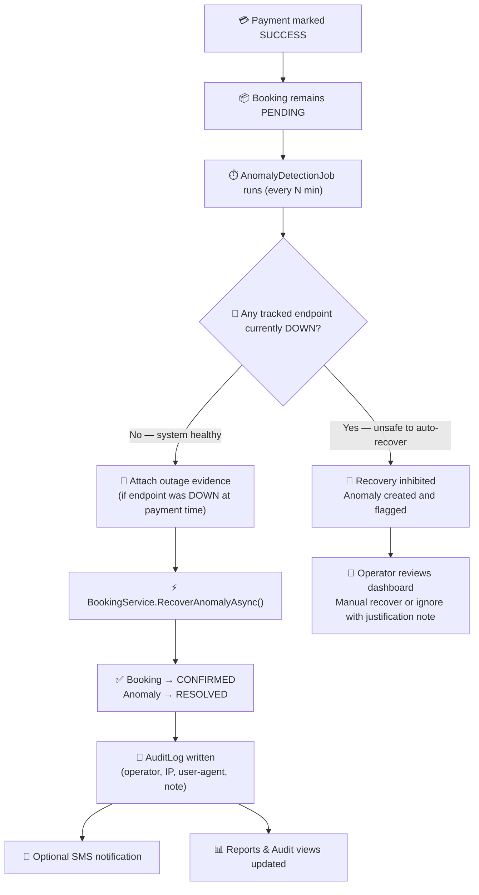
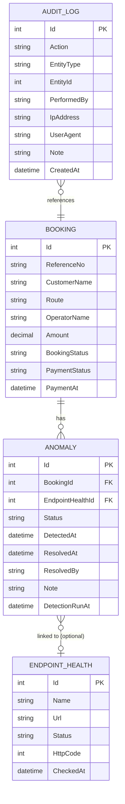

# TicketGuard

[](https://dotnet.microsoft.com/)
[](https://learn.microsoft.com/aspnet/core)
[](https://www.mysql.com/)
[](https://www.questpdf.com/)
[](https://xunit.net/)
[](https://www.docker.com/)

> **Paid. Still pending. Operationally dangerous.**
>
> TicketGuard watches for bookings that cleared payment but never completed, links them to system health events, and gives operators a tight recovery and reporting loop.


<p align="center">
  <strong>🔍 Detection</strong> · <strong>🛡️ Safe Recovery</strong> · <strong>📋 Auditability</strong> · <strong>📊 Operational Reporting</strong>
</p>

---

## 🎯 Why This Project Matters for an Application Support Developer Role

This is not a CRUD app with charts.

It is a **.NET operations case study** built around the kind of work support developers actually do in production:

- 🚨 Monitor business-critical payment failures in near real-time
- 🔗 Correlate stuck bookings with upstream endpoint outages
- 🛡️ Execute guarded, auditable recovery — only when it is safe to do so
- 📋 Leave a complete audit trail that any operator or engineer can trust
- 📊 Generate operational reports with actionable recovery metrics

For a role like **Application Support Developer (C# .NET)**, this demonstrates the mindset gap that separates a support engineer from a generic backend developer.

---

## 🧠 The Problem Statement

In any booking system, the riskiest failures are not the loud ones.

They are the **silent ones**:

```
Payment marked SUCCESS  →  Booking stays PENDING  →  Customer expects a ticket that never arrives
```

The gap between a confirmed payment and an issued ticket is where real money and customer trust are lost.
TicketGuard is built specifically around that gap — to detect it, explain it, and help operators close it safely.

---

## ✨ Feature Overview

| Area | What Exists Right Now |
|---|---|
| 🔍 **Detection** | Background job scans for stuck bookings every N minutes |
| 🔗 **Correlation** | Links anomalies to nearby endpoint `DOWN` events when evidence exists |
| 🛡️ **Safety Gate** | Blocks auto-recovery when any tracked endpoint is currently `DOWN` |
| ♻️ **Recovery** | Single and bulk recovery with transaction integrity |
| 📋 **Audit Trail** | Every recover/ignore action writes operator, IP, user-agent, and note |
| 📱 **SMS Follow-up** | Optional post-recovery notification attempt |
| 📊 **Reports** | Monthly CSV download; PDF pipeline implemented but not yet exposed in UI |
| 🔐 **Security** | JWT auth, CSP headers, anti-forgery tokens, `X-Frame-Options`, `X-Content-Type-Options` |

---

## 🏗️ How It Works

### Operator Flow



---

## 🔗 Correlation Logic — The Smart Part

**This is the most operationally significant feature.**

TicketGuard does not just detect stuck bookings — it asks: *why* was the booking stuck?

When `AnomalyDetectionJob` finds a stuck booking, it looks back in `EndpointHealths` for any endpoint that was `DOWN` within the relevant time window. If evidence exists, the anomaly is linked to that endpoint health record.

**What this means for a support operator:**

| Without Correlation | With Correlation |
|---|---|
| "Booking REF-001 is stuck." | "Booking REF-001 stuck at 14:32. Payment Gateway was DOWN (503) from 14:28 to 14:41." |
| Operator must manually check logs | Root-cause evidence surfaced automatically |
| Investigation takes 10–30 minutes | Decision can be made in seconds |

**The safety gate uses the same signal:**

```csharp
// AnomalyDetectionJob — simplified
var anyDown = latestHealthByEndpoint.Any(h => h.Status == "DOWN");
if (anyDown && autoRecoveryEnabled)
{
    _logger.LogWarning("Auto-recovery skipped — endpoint(s) currently DOWN.");
    return; // Inhibit recovery for this run
}
```

This means correlation drives both forensic context **and** real-time operational decisions.

---

## 🗃️ Data Model



**Entity notes:**

- `ANOMALY.EndpointHealthId` is nullable — most anomalies will not have a linked endpoint event. Correlation is opportunistic, not required.
- `AUDIT_LOG.EntityType` can be `Booking` (on `RECOVER`) or `Anomaly` (on `IGNORE`) — the same table covers both action types.
- `ANOMALY.Status` states: `OPEN` → `RESOLVED` or `IGNORED`. Transitions are enforced in `BookingService`; an already-closed anomaly returns 409.

---

## ⚙️ Runtime Components

### Background Jobs

| Job | Schedule | Role |
|---|---|---|
| `AnomalyDetectionJob` | Every N min (configurable) | Detects stuck bookings, links outage evidence, auto-recovers eligible records |
| `EndpointHealthCheckJob` | Every N min (configurable) | Polls configured endpoints, stores `UP` / `DEGRADED` / `DOWN` snapshots |
| `MonthlyReportEmailJob` | Monthly | Generates last month's PDF and emails it when configured |

### Core Services

| Service | Role |
|---|---|
| `BookingService` | Single recover, ignore, bulk recover — all with transaction integrity and audit logging |
| `ReportService` | Reports page data aggregation and monthly CSV export |
| `MonthlyPdfReportService` | Monthly PDF generation via QuestPDF |
| `SmsNotificationService` | External HTTP-based SMS follow-up after recovery |
| `PaymentGatewayService` | Payment verification abstraction (currently simulated) |

---

## 🔑 Key Technical Challenges & Solutions

### 1. Transaction Integrity in Bulk Recovery

**Challenge:** Recovering multiple bookings in a single operator action must be all-or-nothing. A partial recovery (some bookings confirmed, others skipped) leaves the system in an inconsistent, hard-to-audit state.

**Solution:** `BulkRecoverAnomaliesAsync` wraps all DB mutations inside a single `BeginTransactionAsync()` / `CommitAsync()` block. EF Core's `CreateExecutionStrategy()` ensures the strategy respects MySQL's transient fault handling. If **any** booking fails validation (e.g., `PaymentStatus != "SUCCESS"`), the entire transaction is rolled back — no confirmations, no audit logs.

```csharp
var strategy = _dbContext.Database.CreateExecutionStrategy();
return await strategy.ExecuteAsync(async () =>
{
    using var transaction = await _dbContext.Database.BeginTransactionAsync();
    try
    {
        // validate ALL anomalies before modifying ANY
        foreach (var anomaly in anomalies)
        {
            if (anomaly.Booking.PaymentStatus != "SUCCESS")
                throw new InvalidOperationException($"...");
        }
        // apply all changes then commit atomically
        await _dbContext.SaveChangesAsync();
        await transaction.CommitAsync();
    }
    catch
    {
        await transaction.RollbackAsync();
        throw;
    }
});
```

**Test coverage:** `BulkRecover_ShouldRollback_WhenAnyBookingPaymentIsInvalid` verifies that even if 1-of-N bookings has an invalid payment status, all N bookings remain `PENDING` and zero audit logs are written.

---

### 2. Avoiding Duplicate Anomaly Records

**Challenge:** The detection job runs on a timer. Without a duplicate guard, re-running on the same stuck bookings would create multiple anomaly records per booking, polluting reports and confusing operators.

**Solution:** Before creating an anomaly, the job queries for any existing `OPEN` or `RESOLVED` anomaly for that `BookingId`. New records are only inserted when no prior anomaly exists.

**Test coverage:** `DetectAnomalies_ShouldNotDuplicate_WhenAnomalyAlreadyExists` seeds an existing `OPEN` anomaly, runs the job, and asserts a count of exactly 1.

---

### 3. Safety Gate Before Auto-Recovery

**Challenge:** Auto-recovering bookings during an active upstream outage is dangerous. The payment gateway or booking system may still be in a degraded state, meaning a "recovery" action would silently fail or create a new broken state.

**Solution:** Before any auto-recovery is attempted, the job reads the latest status snapshot for each tracked endpoint. If **any** are `DOWN`, the entire auto-recovery pass is skipped for that run.

---

### 4. HTTP Cookie Auth on Localhost

**Challenge:** `Secure=true` cookies are rejected by browsers over `http://`. Running locally without TLS caused repeated 401s from every API call — a subtle, hard-to-diagnose startup failure.

**Solution:** Cookie security is bound to the request protocol: `Secure = Request.IsHttps`. This allows local HTTP development without modifying browser flags, while production HTTPS gets secure cookies automatically.

---

## 📜 Logging Strategy

TicketGuard uses **Serilog** with structured (key=value) log output. Every significant state transition emits a named event with contextual properties, making logs grep-able and dashboard-friendly without requiring a log aggregator in the default config.

### What Gets Logged

| Event | Level | Key Properties |
|---|---|---|
| Stuck booking detected | `Information` | `BookingId`, `ReferenceNo`, `PaymentAt` |
| Duplicate anomaly skipped | `Debug` | `BookingId` |
| Outage evidence linked | `Information` | `BookingId`, `EndpointName`, `EndpointStatus` |
| Auto-recovery inhibited (endpoint DOWN) | `Warning` | endpoint names |
| Booking recovered | `Information` | `BookingId`, `ReferenceNo`, `RecoveredBy` |
| Anomaly ignored | `Information` | `AnomalyId`, `IgnoredBy` |
| Bulk recovery started / completed | `Information` | `AnomalyCount`, `RecoveredBy` |
| SMS send attempted | `Information` / `Warning` | `BookingId`, `Attempted`, `Success` |
| Recovery error (unexpected) | `Error` | full exception, `AnomalyId` |
| Endpoint health poll result | `Debug` / `Warning` | `EndpointName`, `Status`, `HttpCode` |

### Format

Default output is **plain-text structured** for local development:

```
[18:04:12 INF] Booking recovered. BookingId=42 Reference=REF-9901 RecoveredBy=admin@monitor.dev
[18:04:12 WRN] SMS send skipped. SmsEnabled=False
```

Serilog's `WriteTo.Console()` is configured in `Program.cs`. Switching to JSON output (e.g. for Datadog or Seq) requires adding `Serilog.Formatting.Compact` and changing the sink — no code changes in business logic.

---

## 🖥️ What an Operator Sees

| Surface | URL | Purpose |
|---|---|---|
| **Dashboard** | `/` | Live anomaly feed, recovered value, endpoint pulse, quick-action buttons |
| **Reports** | `/reports` | Trends, cause distribution, recovery performance, CSV export |
| **Audit Log** | `/audit` | Full history: who acted, on what, with what note, from which IP |
| **Health History** | `/health/history` | Endpoint stability over time, context for safety-gate decisions |


---

## 🗂️ Project Structure

```text
booking-guardian/
├── BookingGuardian/               # ASP.NET Core app
│   ├── BackgroundServices/        # AnomalyDetectionJob, EndpointHealthCheckJob, MonthlyReportEmailJob
│   ├── Controllers/               # AnomalyController, ReportsController, AuditController, HealthController
│   ├── Services/                  # BookingService, ReportService, SmsNotificationService, etc.
│   ├── Models/                    # Booking, Anomaly, EndpointHealth, AuditLog, AnomalyResponse
│   ├── Data/                      # BookingDbContext (EF Core)
│   ├── Views/                     # Razor MVC views (Dashboard, Reports, Audit, Health)
│   ├── wwwroot/                   # Static assets, CSS, JS
│   ├── Program.cs                 # App composition root, middleware, DI registration
│   └── appsettings.json           # Runtime configuration
├── BookingGuardian.Tests/         # Unit tests (xUnit + Moq + EF InMemory)
│   ├── AnomalyDetectionTests.cs   # Detection, deduplication, outage correlation
│   └── BookingServiceTests.cs     # Recovery, ignore, bulk recovery, audit log, rollback
├── database/seed.sql              # MySQL schema + seed data
├── docker-compose.yml             # Local MySQL + app stack
└── Dockerfile                     # App container build
```

---

## 🧪 Testing

### Run Tests

```bash
dotnet test BookingGuardian.sln
```

### Test Coverage by Domain

| Area | What Is Tested |
|---|---|
| **Detection** | Flags stuck bookings correctly; ignores already-confirmed bookings |
| **Deduplication** | Does not create a second anomaly when one already exists |
| **Outage Correlation** | Links anomaly to `EndpointHealth` record when endpoint was `DOWN` at payment time |
| **Single Recovery** | Success path, invalid payment status, already-resolved conflict (409), short note (422) |
| **Audit Logging** | Verify operator email and IP are written to `AuditLogs` on every recovery |
| **Bulk Recovery — Happy Path** | All N bookings confirmed, all N audit logs written, correct `AffectedCount` |
| **Bulk Recovery — Rollback** | Any invalid booking in the batch: zero confirmations, zero audit logs (full atomic rollback) |

### Test Architecture

Tests use **EF Core InMemory** provider for speed and isolation. Each test class gets a fresh `Guid`-named database, preventing state leakage between tests.

External dependencies (`ISmsNotificationService`, `IPaymentGatewayService`, `IBookingService`) are mocked with **Moq**. The SMS mock is configured to return `Attempted = false, Success = true` by default, keeping recovery tests clean without real HTTP calls.

---

## 🚀 Quick Start

### Prerequisites

- Docker Desktop (for MySQL)
- .NET 8 SDK

### 1. Start Infrastructure

```bash
docker-compose up -d
```

This starts:

- **MySQL 8** on `localhost:3306`
- **App container** on `http://localhost:5080`

### 2. Run the App Locally (without Docker for the app)

```bash
cd BookingGuardian
dotnet run
```

If runtime environment variables are not set, the app reads from `BookingGuardian/appsettings.json`.

### 3. Log In

| Field | Value |
|---|---|
| Email | `admin@monitor.dev` |
| Password | `Monitor1234!` |

(Seeded from `database/seed.sql`)

---

## ⚙️ Configuration Reference

### Environment Variables

| Variable | Purpose |
|---|---|
| `DB_CONNECTION_STRING` | MySQL connection string |
| `JWT_SECRET` | JWT signing key |

### Key `appsettings.json` Settings

| Key | Description | Default |
|---|---|---|
| `AnomalyDetection:IntervalMinutes` | How often the detection job runs | `5` |
| `AnomalyDetection:ThresholdMinutes` | Minimum age of a stuck booking before flagging | `10` |
| `AnomalyDetection:AutoRecoveryEnabled` | Toggle auto-recovery on/off | `false` |
| `HealthCheck:IntervalMinutes` | Endpoint polling frequency | `5` |
| `HealthCheck:Endpoints` | Array of endpoint names + URLs to monitor | — |
| `SmsService:Enabled` | Enable SMS follow-up after recovery | `false` |
| `SmsService:Url` | SMS provider HTTP endpoint | — |
| `MonthlyReport:AutoSend` | Auto-email monthly PDF report | `false` |
| `MonthlyReport:Recipients` | Email addresses for monthly report | — |
| `PaymentGateway:Enabled` | Enable real payment verification calls | `false` |

---

## 🔐 Security & Auth

| Feature | Implementation |
|---|---|
| **Authentication** | JWT stored in `JWT_TOKEN` cookie |
| **Authorization** | `AdminOnly` and `SupportOrAdmin` policies |
| **CSRF Protection** | Anti-forgery validation on all mutating endpoints |
| **Content Security Policy** | Restrictive CSP header on all responses |
| **Clickjacking Protection** | `X-Frame-Options: DENY` |
| **MIME Sniffing Prevention** | `X-Content-Type-Options: nosniff` |
| **Referrer Policy** | `Referrer-Policy: strict-origin-when-cross-origin` |
| **XSS** | HTML-escaped in Razor views; no raw `innerHTML` with unsanitized data |

---

## 📤 Export Surface

| Surface | Format | Status |
|---|---|---|
| Reports page UI | CSV | ✅ Visible button in current UI |
| `/reports/download?format=csv` | CSV | ✅ Implemented |
| `/reports/download?format=pdf` | PDF | ⚠️ Implemented in backend, not yet linked from reports page UI |
| `/audit/export` | CSV | ✅ Implemented |

> **Honest note:** PDF generation is fully implemented in `MonthlyPdfReportService` and the reports controller. It is not currently wired to a button in the UI. This boundary is kept explicit because accurately describing current system state is itself a support engineering skill.

---

## 🛠️ Tech Stack

| Layer | Technology |
|---|---|
| Runtime | .NET 8 |
| Framework | ASP.NET Core MVC + Web API |
| ORM | Entity Framework Core |
| Database | MySQL 8 |
| Logging | Serilog |
| PDF Generation | QuestPDF |
| Testing | xUnit + Moq + EF InMemory |
| Containerisation | Docker Compose |

---

## ⚠️ Implementation Boundaries

- `PaymentGatewayService` is **simulated** — it does not call a real payment provider API
- `SmsNotificationService` is **opt-in** — only sends when `SmsService:Enabled = true` and a target URL is configured
- `MonthlyReport:AutoSend` is `false` by default — no emails are sent unless explicitly enabled
- There is no `.env.example` — configuration lives in environment variables or `appsettings.json`

---

## 🔭 What I'd Build Next

These are the next steps I would prioritise if this project moved toward production use, ranked by operational impact:

### High Impact

| Item | Why |
|---|---|
| **Expose PDF download in the reports UI** | The backend is implemented; it just needs a button and a `?format=pdf` query param wired to it |
| **Add a `.env.example`** | Every engineer who clones this repo has to read `appsettings.json` to know what env vars are needed — a template fixes this in 5 minutes |
| **Idempotency key on recovery actions** | Double-click on "Recover" can currently fire two requests. A per-anomaly idempotency check at the API level prevents phantom double-recoveries |
| **Real payment gateway integration** | `PaymentGatewayService` is the riskiest simulated boundary — in production, recovery should re-verify payment status with the actual provider before confirming |

### Medium Impact

| Item | Why |
|---|---|
| **Serilog JSON sink (Seq / Datadog)** | Structured logs exist; they are just going to console. Adding `WriteTo.Seq()` or `WriteTo.Datadog()` unlocks search, alerting, and dashboards without code changes in business logic |
| **Pagination on audit and dashboard views** | High-volume environments will accumulate thousands of anomalies. EF queries are currently unbounded |
| **Alerting on sustained anomaly spike** | If 20+ bookings go stuck within 10 minutes, something systemic is wrong. A threshold-based alert would catch this before a human notices on the dashboard |
| **Integration tests against real MySQL** | EF InMemory works well for unit tests but does not validate index performance, constraint enforcement, or connection pool behaviour against the actual engine |

### Deliberate Trade-offs

| Decision | Rationale |
|---|---|
| **Single-tenant, single DB** | Appropriate for the scope. Adding multi-tenancy would add row-level isolation complexity that obscures the core recovery logic without improving the portfolio signal |
| **No event queue (Kafka/SQS)** | The detection loop is pull-based on a timer rather than push-based on payment events. Simpler, testable, and sufficient for the anomaly volume this system is designed for |
| **EF Core over raw SQL** | The query patterns here are simple enough that ORM overhead is negligible. For a high-throughput write path this would be revisited |
