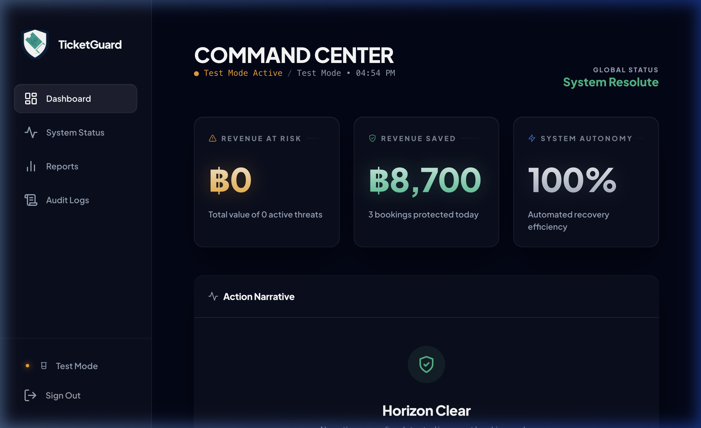
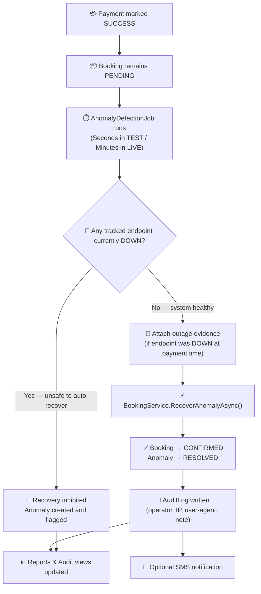
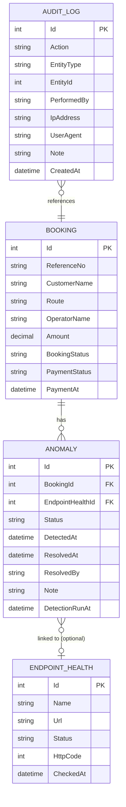
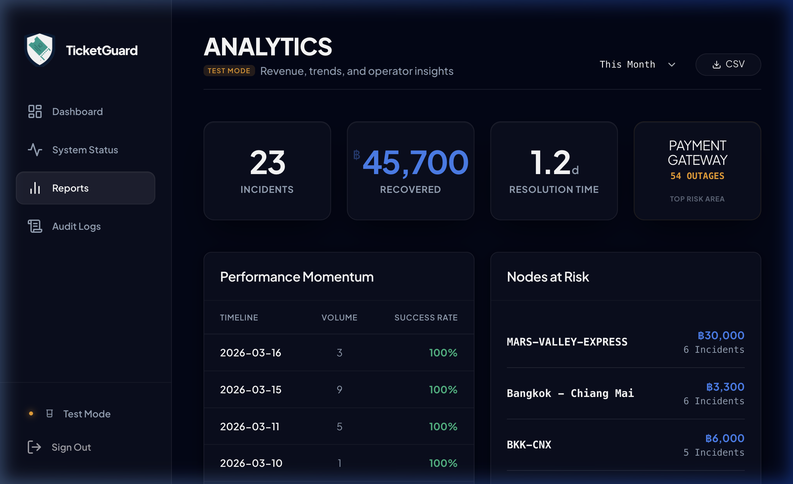
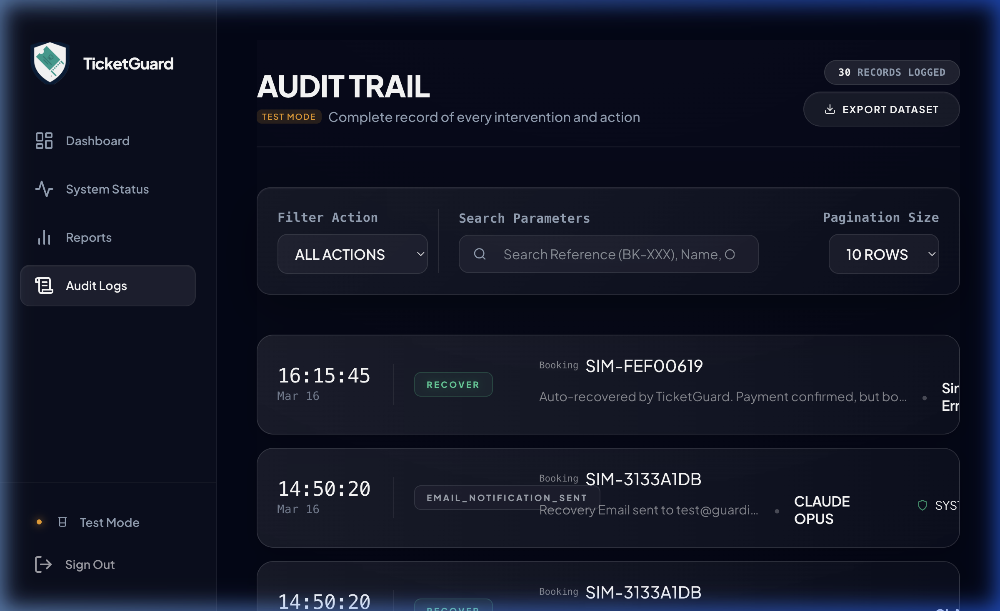
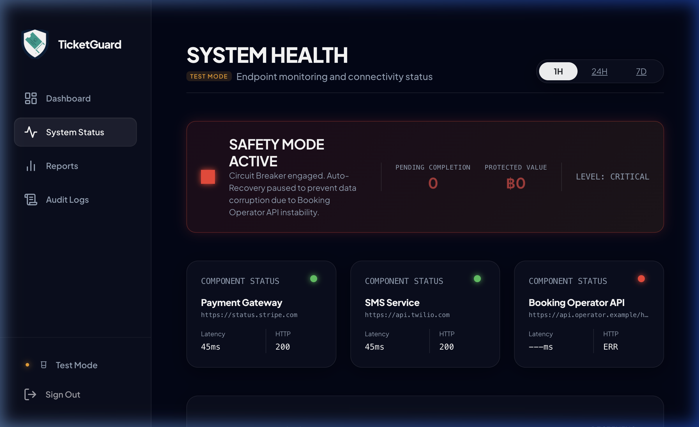
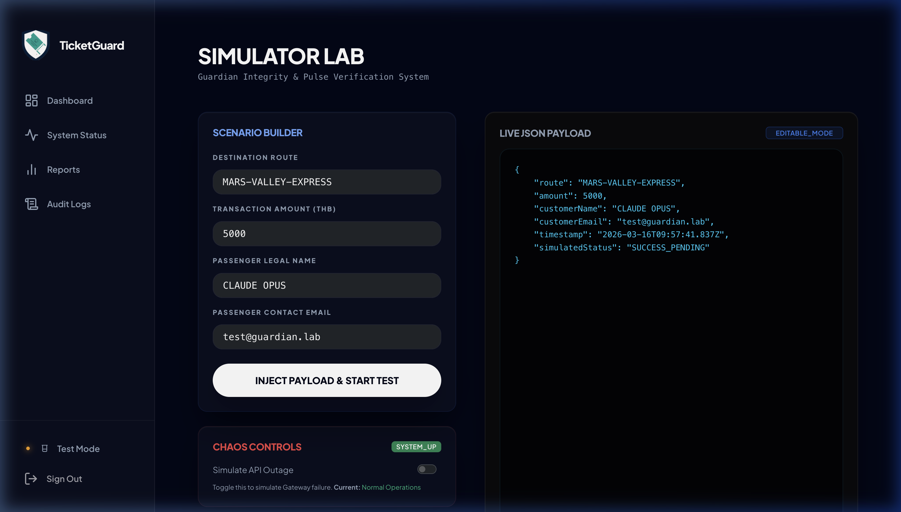

# TicketGuard

[](https://dotnet.microsoft.com/)
[](https://learn.microsoft.com/aspnet/core)
[](https://www.mysql.com/)
[](https://www.questpdf.com/)
[](https://xunit.net/)
[](https://www.docker.com/)

> **Silent Failures. Financial Risk. Operational Excellence.**
>
> TicketGuard is a precision operational fortress designed for the "silent failure window" — the dangerous gap where a payment succeeds but the business logic fails to complete. It doesn't just monitor; it correlates, guards, and rescues.



<p align="center">
  <strong>🛡️ Revenue Rescue</strong> · <strong>🔍 Forensic Correlation</strong> · <strong>🚦 Guarded Recovery</strong> · <strong>📋 Immutable Audit</strong>
</p>

---

## 🎯 The SRE Perspective: Why This Project Exists

Most developers build for the "Happy Path." TicketGuard is built for the **"Broken Path."**

This is an **Application Support & SRE Case Study** focused on high-stakes production scenarios:

- **🚨 Zero-Day Detection**: Identify business-critical silent failures where money has changed hands but value was not delivered.
- **🔗 Forensic Context**: Automatically correlate data anomalies with upstream telemetry to eliminate manual log-diving.
- **🛡️ Guarded Auto-Recovery**: An intelligent "Circuit Breaker" that inhibits automated fixes during active outages to prevent state corruption.
- **📊 Revenue Guardrails**: Shifting metrics from "CPU usage" to "Revenue Rescued" and "Mean Time to Recovery (MTTR)."

This project demonstrates the transition from a "Coder" to an "Operator" who understands that **uptime is a business requirement, not just a technical goal.**

---

## 🧠 The Problem Statement

In any booking system, the riskiest failures are not the loud ones.

They are the **silent ones**:

```
Payment marked SUCCESS  →  Booking stays PENDING  →  Customer expects a ticket that never arrives
```

The gap between a confirmed payment and an issued ticket is where real money and customer trust are lost.
TicketGuard is built specifically around that gap — to detect it, explain it, and help operators close it safely.

## 🎬 System in Action (Walking Through a Crisis)

Below is a recorded walkthrough showing the **Chaos-to-Recovery** flow: 
1. **Outage Simulation** via the Simulator Lab 
2. **Safety Gate Activation** (Circuit Breaker) 
3. **Forensic Evidence Linking** 
4. **Autonomous Resolution** once the environment is stable.


---

| Area | Strategic Value | Status |
|---|---|---|
| 🔍 **Detection** | **Dual-Speed Engine**: Fast feedback (Seconds) in Test vs. Scalable stability (Minutes) in Live. | ✅ |
| 🔗 **Correlation** | **Context Injection**: Links anomalies to specific `DOWN` events for instant root-cause analysis. | ✅ |
| 🛡️ **Safety Gate** | **Dynamic Guard**: Blocks recovery only for active dependencies defined in current configuration. | ✅ |
| 🧪 **Chaos Tool** | **System Simulator**: Built-in engine to inject outages and verify recovery logic under fire. | ✅ |
| 📋 **Audit Trail** | **Immutable Ledger**: Captures operator, IP, and intent for every system mutation. | ✅ |
| 📊 **Analytics** | **Operational Pulse**: Tracks MTTR and "Revenue at Risk" by node/route. | ✅ |
| 🔐 **Security** | **Hardened Core**: JWT via Cookies, strict CSP, Anti-Forgery, and Secure Headers. | ✅ |

---

## 🏗️ How It Works

### System Logic Flow



---

## 🔗 Correlation Logic — The Smart Part

**This is the most operationally significant feature.**

TicketGuard does not just detect stuck bookings — it asks: *why* was the booking stuck?

When `AnomalyDetectionJob` finds a stuck booking, it looks back in `EndpointHealths` for any endpoint that was `DOWN` within the relevant time window. If evidence exists, the anomaly is linked to that endpoint health record.

**Operational Impact:**

| Without Correlation | With Correlation |
|---|---|
| "Booking REF-001 is stuck." | "Booking REF-001 stuck at 14:32. Payment Gateway was DOWN (503) from 14:28 to 14:41." |
| Operator must manually check logs | Root-cause evidence surfaced automatically |
| Investigation takes 10–30 minutes | Root cause is surfaced in seconds |

**The safety gate uses the same signal:**

```csharp
// AnomalyDetectionJob — simplified
var anyDown = latestHealthByEndpoint.Any(h => h.Status == "DOWN");
if (anyDown && autoRecoveryEnabled)
{
    _logger.LogWarning("Auto-recovery skipped — endpoint(s) currently DOWN.");
    return; // Inhibit recovery for this run
}
```

This means correlation drives both forensic context **and** real-time operational decisions.

---

## 🗃️ Data Model



**Entity notes:**

- `ANOMALY.EndpointHealthId` is nullable — most anomalies will not have a linked endpoint event. Correlation is opportunistic, not required.
- `AUDIT_LOG.EntityType` can be `Booking` (on `RECOVER`) or `Anomaly` (on `IGNORE`) — the same table covers both action types.
- `ANOMALY.Status` states: `OPEN` → `RESOLVED` or `IGNORED`. Transitions are enforced in `BookingService`; an already-closed anomaly returns 409.

---

## ⚙️ Runtime Components

### Background Jobs

| Job | Schedule | Role |
|---|---|---|
| `AnomalyDetectionJob` | Every N min (configurable) | Detects stuck bookings, links outage evidence, auto-recovers eligible records |
| `EndpointHealthCheckJob` | Every N min (configurable) | Polls configured endpoints, stores `UP` / `DEGRADED` / `DOWN` snapshots |
| `MonthlyReportEmailJob` | Monthly | Generates last month's PDF and emails it when configured |

### Core Services

| Service | Role |
|---|---|
| `BookingService` | Single recover, ignore, bulk recover — all with transaction integrity and audit logging |
| `SystemModeService` | Manages global system state (TEST/LIVE) and informs job timings |
| `ReportService` | Reports page data aggregation and monthly CSV export |
| `MonthlyPdfReportService` | Monthly PDF generation via QuestPDF |
| `SmsNotificationService` | External HTTP-based SMS follow-up after recovery |
| `PaymentGatewayService` | Payment verification abstraction (currently simulated) |

---

## 🔑 Key Technical Challenges & Solutions

### 1. Transaction Integrity in Bulk Recovery

**Challenge:** Recovering multiple bookings must be all-or-nothing. A partial recovery (some bookings confirmed, others skipped) leaves the system in an inconsistent, hard-to-audit state.

**Solution:** `BulkRecoverAnomaliesAsync` wraps all DB mutations inside a single `BeginTransactionAsync()` / `CommitAsync()` block. EF Core's `CreateExecutionStrategy()` ensures the strategy respects MySQL's transient fault handling. If **any** booking fails validation (e.g., `PaymentStatus != "SUCCESS"`), the entire transaction is rolled back — no confirmations, no audit logs.

```csharp
var strategy = _dbContext.Database.CreateExecutionStrategy();
return await strategy.ExecuteAsync(async () =>
{
    using var transaction = await _dbContext.Database.BeginTransactionAsync();
    try
    {
        // validate ALL anomalies before modifying ANY
        foreach (var anomaly in anomalies)
        {
            if (anomaly.Booking.PaymentStatus != "SUCCESS")
                throw new InvalidOperationException($"...");
        }
        // apply all changes then commit atomically
        await _dbContext.SaveChangesAsync();
        await transaction.CommitAsync();
    }
    catch
    {
        await transaction.RollbackAsync();
        throw;
    }
});
```

**Test coverage:** `BulkRecover_ShouldRollback_WhenAnyBookingPaymentIsInvalid` verifies that even if 1-of-N bookings has an invalid payment status, all N bookings remain `PENDING` and zero audit logs are written.

---

### 2. Avoiding Duplicate Anomaly Records

**Challenge:** The detection job runs on a timer. Without a duplicate guard, re-running on the same stuck bookings would create multiple anomaly records per booking, polluting reports and confusing operators.

**Solution:** Before creating an anomaly, the job queries for any existing `OPEN` or `RESOLVED` anomaly for that `BookingId`. New records are only inserted when no prior anomaly exists.

**Test coverage:** `DetectAnomalies_ShouldNotDuplicate_WhenAnomalyAlreadyExists` seeds an existing `OPEN` anomaly, runs the job, and asserts a count of exactly 1.

---

### 3. Safety Gate Before Auto-Recovery

**Challenge:** Auto-recovering bookings during an active upstream outage is dangerous. The payment gateway or booking system may still be in a degraded state, meaning a "recovery" action would silently fail or create a new broken state.

**Solution:** Before any auto-recovery is attempted, the job reads the latest status snapshot for each tracked endpoint. If **any** are `DOWN`, the entire auto-recovery pass is skipped for that run.

---

### 4. HTTP Cookie Auth on Localhost

**Challenge:** `Secure=true` cookies are rejected by browsers over `http://`. Running locally without TLS caused repeated 401s from every API call — a subtle, hard-to-diagnose startup failure.

**Solution:** Cookie security is bound to the request protocol: `Secure = Request.IsHttps`. This allows local HTTP development without modifying browser flags, while production HTTPS gets secure cookies automatically.

---

## 📜 Logging & Observability Strategy

TicketGuard moves beyond console logs to **Structured Telemetry**. We use **Serilog** with a multi-sink configuration to ensure technical debuggability and operational auditing.

### Persistence Layer
- **Standard Output**: Color-coded Console logs for real-time development.
- **MySQL Persistence**: Structured logs are written to the `app_logs` table. This allows for **SQL-based incident investigation** and historical trend analysis without external aggregators.

### Diagnostic Events
| Event | Insight Provided |
|---|---|
| **Stuck Booking** | Real-time notification of commercial risk. |
| **Circuit Breaker Trip** | Visibility into why automated recovery was inhibited. |
| **Forensic Linkage** | Proof that a specific outage caused a specific booking failure. |
| **Recovery Mutation** | Full accountability for system state changes. |

### Format

Default output is **plain-text structured** for local development:

```
[18:04:12 INF] Booking recovered. BookingId=42 Reference=REF-9901 RecoveredBy=admin@monitor.dev
[18:04:12 WRN] SMS send skipped. SmsEnabled=False
```

Serilog's `WriteTo.Console()` is configured in `Program.cs`. Switching to JSON output (e.g. for Datadog or Seq) requires adding `Serilog.Formatting.Compact` and changing the sink — no code changes in business logic.

---

## �️ Full Module Tour

### 1. Operations Command Center (Dashboard)
The primary cockpit for real-time monitoring. Highlights "Revenue at Risk" and active system health.


### 2. Forensic Analytics & Revenue Insights
Tracking the financial impact of silent failures and component reliability trends.


### 3.📋 Immutable Audit Trail
A complete, non-repudiable record of every system-led and simulated intervention.


### 4. System Health Telemetry
Live dependency monitoring with integrated Circuit Breaker logic signals.


### 5. Simulator Lab (Chaos Tooling)
The engine used to inject outages and verify system resilience under fire.


---

## 🗂️ Project Structure

```text
booking-guardian/
├── BookingGuardian/               # ASP.NET Core app
│   ├── BackgroundServices/        # AnomalyDetectionJob, EndpointHealthCheckJob, MonthlyReportEmailJob
│   ├── Controllers/               # AnomalyController, ReportsController, AuditController, HealthController
│   ├── Services/                  # BookingService, ReportService, SmsNotificationService, etc.
│   ├── Models/                    # Booking, Anomaly, EndpointHealth, AuditLog, AnomalyResponse
│   ├── Data/                      # BookingDbContext (EF Core)
│   ├── Views/                     # Razor MVC views (Dashboard, Reports, Audit, Health)
│   ├── wwwroot/                   # Static assets, CSS, JS
│   ├── Program.cs                 # App composition root, middleware, DI registration
│   └── appsettings.json           # Runtime configuration
├── BookingGuardian.Tests/         # Unit tests (xUnit + Moq + EF InMemory)
│   ├── AnomalyDetectionTests.cs   # Detection, deduplication, outage correlation
│   └── BookingServiceTests.cs     # Recovery, ignore, bulk recovery, audit log, rollback
├── database/seed.sql              # MySQL schema + seed data
├── docker-compose.yml             # Local MySQL + app stack
└── Dockerfile                     # App container build
```

---

## 🧪 Testing

### Run Tests

```bash
dotnet test BookingGuardian.sln
```

### Test Coverage by Domain

| Area | What Is Tested |
|---|---|
| **Detection** | Flags stuck bookings correctly; ignores already-confirmed bookings |
| **Deduplication** | Does not create a second anomaly when one already exists |
| **Outage Correlation** | Links anomaly to `EndpointHealth` record when endpoint was `DOWN` at payment time |
| **Single Recovery** | Success path, invalid payment status, already-resolved conflict (409), short note (422) |
| **Audit Logging** | Verify operator email and IP are written to `AuditLogs` on every recovery |
| **Bulk Recovery — Happy Path** | All N bookings confirmed, all N audit logs written, correct `AffectedCount` |
| **Bulk Recovery — Rollback** | Any invalid booking in the batch: zero confirmations, zero audit logs (full atomic rollback) |

### Test Architecture

Tests use **EF Core InMemory** provider for speed and isolation. Each test class gets a fresh `Guid`-named database, preventing state leakage between tests.

External dependencies (`ISmsNotificationService`, `IPaymentGatewayService`, `IBookingService`) are mocked with **Moq**. The SMS mock is configured to return `Attempted = false, Success = true` by default, keeping recovery tests clean without real HTTP calls.

---

## 🚀 Quick Start

### Prerequisites

- Docker Desktop (for MySQL)
- .NET 8 SDK

### 1. Start Infrastructure

```bash
docker-compose up -d
```

This starts:

- **MySQL 8** on `localhost:3306`
- **App container** on `http://localhost:5080`

> [!TIP]
> On the first run, MySQL may take 15–30 seconds to initialize and run the `seed.sql` script. The app container is configured to `restart: always` and will automatically reconnect once the database is ready.

### 2. Run the App Locally (without Docker for the app)

```bash
cd BookingGuardian
dotnet run
```

If runtime environment variables are not set, the app reads from `BookingGuardian/appsettings.json`.

### 3. Log In

| Field | Value |
|---|---|
| Email | `admin@monitor.dev` |
| Password | `Monitor1234!` |

(Seeded from `database/seed.sql`)

---

## ⚙️ Configuration Reference

### Environment Variables

| Variable | Purpose |
|---|---|
| `DB_CONNECTION_STRING` | MySQL connection string |
| `JWT_SECRET` | JWT signing key |

### Key `appsettings.json` Settings

| Key | Description | Default |
|---|---|---|
| `AnomalyDetection:IntervalSeconds` | Detection frequency in **TEST Mode** | `15` |
| `AnomalyDetection:ThresholdSeconds` | Flagging threshold in **TEST Mode** | `30` |
| `AnomalyDetection:IntervalMinutes` | Detection frequency in **LIVE Mode** | `5` |
| `AnomalyDetection:ThresholdMinutes` | Flagging threshold in **LIVE Mode** | `10` |
| `AnomalyDetection:AutoRecoveryEnabled` | Toggle auto-recovery on/off | `true` |
| `HealthCheck:IntervalMinutes` | Endpoint polling frequency | `5` |
| `HealthCheck:Endpoints` | Array of endpoint names + URLs to monitor | — |
| `SmsService:Enabled` | Enable SMS follow-up after recovery | `false` |
| `SmsService:Url` | SMS provider HTTP endpoint | — |
| `MonthlyReport:AutoSend` | Auto-email monthly PDF report | `false` |
| `MonthlyReport:Recipients` | Email addresses for monthly report | — |
| `PaymentGateway:Enabled` | Enable real payment verification calls | `false` |

---

## 🔐 Security & Auth

| Feature | Implementation |
|---|---|
| **Authentication** | JWT stored in `JWT_TOKEN` cookie |
| **Authorization** | `AdminOnly` and `SupportOrAdmin` policies |
| **CSRF Protection** | Anti-forgery validation on all mutating endpoints |
| **Content Security Policy** | Restrictive CSP header on all responses |
| **Clickjacking Protection** | `X-Frame-Options: DENY` |
| **MIME Sniffing Prevention** | `X-Content-Type-Options: nosniff` |
| **Referrer Policy** | `Referrer-Policy: strict-origin-when-cross-origin` |
| **XSS** | HTML-escaped in Razor views; no raw `innerHTML` with unsanitized data |

---

## 📤 Export Surface

| Surface | Format | Status |
|---|---|---|
| Reports page UI | CSV | ✅ Visible button in current UI |
| `/reports/download?format=csv` | CSV | ✅ Implemented |
| `/reports/download?format=pdf` | PDF | ⚠️ Implemented in backend, not yet linked from reports page UI |
| `/audit/export` | CSV | ✅ Implemented |

> **Honest note:** PDF generation is fully implemented in `MonthlyPdfReportService` and the reports controller. It is not currently wired to a button in the UI. This boundary is kept explicit because accurately describing current system state is itself a support engineering skill.

---

## 🛠️ Tech Stack

| Layer | Technology |
|---|---|
| Runtime | .NET 8 |
| Framework | ASP.NET Core MVC + Web API |
| ORM | Entity Framework Core |
| Database | MySQL 8 |
| Logging | Serilog |
| PDF Generation | QuestPDF |
| Testing | xUnit + Moq + EF InMemory |
| Containerisation | Docker Compose |

---

## ⚠️ Implementation Boundaries

- `PaymentGatewayService` is **simulated** — it does not call a real payment provider API
- `SmsNotificationService` is **opt-in** — only sends when `SmsService:Enabled = true` and a target URL is configured
- `MonthlyReport:AutoSend` is `false` by default — no emails are sent unless explicitly enabled
- There is no `.env.example` — configuration lives in environment variables or `appsettings.json`

---

## 🔭 What I'd Build Next

These are the next steps I would prioritise if this project moved toward production use, ranked by operational impact:

### High Impact

| Item | Why |
|---|---|
| **Expose PDF download in the reports UI** | The backend is implemented; it just needs a button and a `?format=pdf` query param wired to it |
| **Add a `.env.example`** | Every engineer who clones this repo has to read `appsettings.json` to know what env vars are needed — a template fixes this in 5 minutes |
| **Idempotency key on recovery actions** | Double-click on "Recover" can currently fire two requests. A per-anomaly idempotency check at the API level prevents phantom double-recoveries |
| **Real payment gateway integration** | `PaymentGatewayService` is the riskiest simulated boundary — in production, recovery should re-verify payment status with the actual provider before confirming |

### Medium Impact

| Item | Why |
|---|---|
| **Serilog JSON sink (Seq / Datadog)** | Structured logs exist; they are just going to console. Adding `WriteTo.Seq()` or `WriteTo.Datadog()` unlocks search, alerting, and dashboards without code changes in business logic |
| **Pagination on audit and dashboard views** | High-volume environments will accumulate thousands of anomalies. EF queries are currently unbounded |
| **Alerting on sustained anomaly spike** | If 20+ bookings go stuck within 10 minutes, something systemic is wrong. A threshold-based alert would catch this before a human notices on the dashboard |
| **Integration tests against real MySQL** | EF InMemory works well for unit tests but does not validate index performance, constraint enforcement, or connection pool behaviour against the actual engine |

---

## 🧠 Strategic Architecture Decisions (ADR)

### ADR 001: Dual-Speed Execution Engine
- **Context**: In production (LIVE), high-frequency scanning puts unnecessary load on the DB. In development (TEST), waiting 10 minutes to verify a fix is unacceptable.
- **Decision**: Implemented `ISystemModeService` to toggle global state.
- **Impact**: TEST Mode uses **Seconds** for instant validation; LIVE Mode uses **Minutes** for resource efficiency.

### ADR 002: Configuration-Bound Safety Gate
- **Context**: Decommissioned or old health check records in the database could permanently "trip" the circuit breaker, stopping all auto-recovery.
- **Decision**: Modified `AnomalyDetectionJob` to filter health signals against the *active* `appsettings.json` list.
- **Impact**: System ignores "ghost" outages and only reacts to currently tracked infrastructure.

### ADR 003: Deterministic Simulation
- **Context**: You cannot wait for a real outage to test an SRE tool. 
- **Decision**: Developed `SystemSimulatorController` to manually flip endpoint states and "plant" anomalies.
- **Impact**: Enables repeatable Chaos Testing and "War Room" drills for support staff.

---

## 🧪 Simulation & Chaos Testing

TicketGuard includes a built-in **Chaos Engine** (accessible via the Simulator Dashboard).

1. **Inject Outage**: Force the "Payment Gateway" to return 503.
2. **Plant Anomaly**: Create a synthetic booking that is "Stuck" (Paid but Pending).
3. **Verify Inhibition**: Watch the `AnomalyDetectionJob` log a warning and block auto-recovery.
4. **Restore & Recover**: Bring the gateway back `UP` and observe the system automatically rescue the booking within the next cycle.

---

---

## � What I'd Build Next

These are the next steps I would prioritise if this project moved toward production use, ranked by operational impact:

### High Impact

| Item | Why |
|---|---|
| **Expose PDF download in the reports UI** | The backend is implemented; it just needs a button and a `?format=pdf` query param wired to it |
| **Add a `.env.example`** | Every engineer who clones this repo has to read `appsettings.json` to know what env vars are needed — a template fixes this in 5 minutes |
| **Idempotency key on recovery actions** | Double-click on "Recover" can currently fire two requests. A per-anomaly idempotency check at the API level prevents phantom double-recoveries |
| **Real payment gateway integration** | `PaymentGatewayService` is the riskiest simulated boundary — in production, recovery should re-verify payment status with the actual provider before confirming |

### Medium Impact

| Item | Why |
|---|---|
| **Serilog JSON sink (Seq / Datadog)** | Structured logs exist; they are just going to console. Adding `WriteTo.Seq()` or `WriteTo.Datadog()` unlocks search, alerting, and dashboards without code changes in business logic |
| **Pagination on audit and dashboard views** | High-volume environments will accumulate thousands of anomalies. EF queries are currently unbounded |
| **Alerting on sustained anomaly spike** | If 20+ bookings go stuck within 10 minutes, something systemic is wrong. A threshold-based alert would catch this before a human notices on the dashboard |
| **Integration tests against real MySQL** | EF InMemory works well for unit tests but does not validate index performance, constraint enforcement, or connection pool behaviour against the actual engine |

---

## 🧠 Strategic Architecture Decisions (ADR)

### ADR 001: Dual-Speed Execution Engine
- **Context**: In production (LIVE), high-frequency scanning puts unnecessary load on the DB. In development (TEST), waiting 10 minutes to verify a fix is unacceptable.
- **Decision**: Implemented `ISystemModeService` to toggle global state.
- **Impact**: TEST Mode uses **Seconds** for instant validation; LIVE Mode uses **Minutes** for resource efficiency.

### ADR 002: Configuration-Bound Safety Gate
- **Context**: Decommissioned or old health check records in the database could permanently "trip" the circuit breaker, stopping all auto-recovery.
- **Decision**: Modified `AnomalyDetectionJob` to filter health signals against the *active* `appsettings.json` list.
- **Impact**: System ignores "ghost" outages and only reacts to currently tracked infrastructure.

### ADR 003: Deterministic Simulation
- **Context**: You cannot wait for a real outage to test an SRE tool. 
- **Decision**: Developed `SystemSimulatorController` to manually flip endpoint states and "plant" anomalies.
- **Impact**: Enables repeatable Chaos Testing and "War Room" drills for support staff.

---

## 🧪 Simulation & Chaos Testing

TicketGuard includes a built-in **Chaos Engine** (accessible via the Simulator Dashboard).

1. **Inject Outage**: Force the "Payment Gateway" to return 503.
2. **Plant Anomaly**: Create a synthetic booking that is "Stuck" (Paid but Pending).
3. **Verify Inhibition**: Watch the `AnomalyDetectionJob` log a warning and block auto-recovery.
4. **Restore & Recover**: Bring the gateway back `UP` and observe the system automatically rescue the booking within the next cycle.
