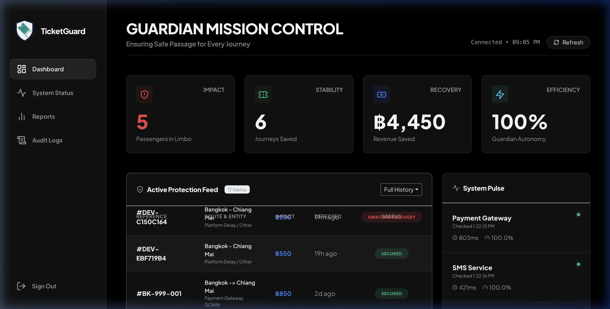
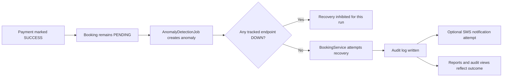

# TicketGuard

[](https://dotnet.microsoft.com/)
[](https://learn.microsoft.com/aspnet/core)
[](https://www.mysql.com/)
[](https://www.questpdf.com/)

> **Paid. Still pending. Operationally dangerous.**
>
> TicketGuard watches for bookings that cleared payment but never completed, links them to system health, and gives operators a tight recovery and reporting loop.


<p align="center">
  <strong>Detection</strong> · <strong>Recovery</strong> · <strong>Auditability</strong> · <strong>Operational reporting</strong>
</p>

## Why this project is relevant for an Application Support Developer role

This is not just a CRUD app with charts.

It is a .NET operations case study built around the kind of work support developers actually do in production:

- monitor business-critical failures
- investigate payment and booking mismatches
- correlate incidents with upstream endpoint health
- recover safely under clear guardrails
- leave an audit trail that another operator can trust

For a role like **Application Support Developer (C# .NET)**, that matters.

The system is deliberately shaped around troubleshooting, operational visibility, and controlled intervention, which is much closer to real support engineering than a generic portfolio project.

## Why this exists

In a booking system, the riskiest failures are not loud failures.  
They are the quiet ones:

- payment is marked `SUCCESS`
- booking stays `PENDING`
- the customer expects a ticket that never arrives

TicketGuard is built around that gap.

## The pitch

Most support tools tell you what broke.

TicketGuard is built to answer a harder question:

**what was paid, what got stranded, and what can still be recovered safely right now?**

That is why the product combines:

- anomaly detection
- endpoint health awareness
- guarded recovery logic
- operator-facing audit and reporting views

## At a glance

| Area | What exists right now |
| --- | --- |
| Detection | Background detection of stuck bookings |
| Recovery | Automatic recovery when enabled and when tracked endpoints are healthy |
| Correlation | Links anomalies to nearby endpoint outages when evidence exists |
| Auditability | Recovery, ignore, and SMS outcomes written to audit logs |
| UI | Dashboard, reports, audit, health history, login |
| Reports UI | CSV download button |
| Backend reports | CSV and PDF generation |

## Product showcase

### Mission control for booking failures

The dashboard is designed as an operations surface, not a marketing dashboard.  
It emphasizes:

- current open issues
- recovered revenue
- operator autonomy
- endpoint pulse
- anomaly state transitions



### Reports built for operations, not vanity

The reports area focuses on incident distribution, recovery value, resolution time, and unstable nodes.

What matters here is not “how pretty charts look,” but whether a team can understand:

- how often the system failed
- where failures clustered
- how much value was recovered
- how fast the recovery loop is improving

### Built with a support mindset

This project tells a support story from end to end:

1. detect the incident
2. inspect surrounding system health
3. decide whether recovery is safe
4. execute a controlled action
5. preserve evidence for follow-up and reporting

That flow is exactly the kind of reasoning hiring teams expect from someone supporting live transaction systems.

## Product surface

### Current UI routes

- `/`
- `/reports`
- `/audit`
- `/health/history`
- `/Account/Login`

### What the reports page actually exposes

The reports page currently exposes **CSV only** from [`BookingGuardian/Views/Reports/Index.cshtml`](/Users/maemp/Desktop/booking-guardian/BookingGuardian/Views/Reports/Index.cshtml).

### What the backend supports beyond the page

- `/reports/download?month=YYYY-MM&format=csv`
- `/reports/download?month=YYYY-MM&format=pdf`

PDF generation is implemented in backend services and the reports controller, but it is **not currently linked from the reports page UI**.

> UI truth:
> operators clicking inside the reports page get CSV today.
>
> Backend truth:
> the reports controller can also return PDF, and the PDF pipeline is implemented.

## Operator flow



## What an operator sees

| Surface | Purpose |
| --- | --- |
| Dashboard | Watch open anomalies, recovered value, and endpoint pulse |
| Reports | Review trends, causes, recovery performance, and export data |
| Audit | Inspect who did what, when, and against which booking or anomaly |
| Health history | Inspect endpoint stability and safety-mode context |

## How it works

### 1. Detection

`AnomalyDetectionJob` scans for bookings where:

- payment is successful
- booking is still pending
- payment time is older than the configured threshold

It creates anomaly records and tries to attach nearby `DOWN` endpoint evidence when a relevant outage exists.

### 2. Safety gate

Before auto-recovery runs, the job checks the latest tracked endpoint states.

If any latest endpoint status is `DOWN`, recovery is inhibited for that run.

### 3. Recovery

When recovery is allowed, `BookingService`:

- confirms the booking
- marks the anomaly as resolved
- writes audit logs
- attempts a post-recovery SMS notification

Bulk recovery is also implemented and handled atomically.

### 4. Reporting

`ReportService` builds the reports page and monthly CSV output.

`MonthlyPdfReportService` generates PDF reports with QuestPDF, including:

- total anomalies detected
- resolved
- ignored
- unresolved
- revenue recovered
- mean time to resolve
- endpoint uptime
- top causes
- recommendations

## Why the product feels different

Most internal tools are built as CRUD plus charts.

TicketGuard is closer to an operational control room:

- it names the failure mode clearly
- it centers recovery, not just observation
- it treats endpoint health as a first-class decision input
- it keeps a visible audit trail around every intervention

## What this README is trying to show

This README is intentionally written as a product showcase, but it is also meant to signal engineering judgment.

It shows three things:

- the business failure mode is understood clearly
- the .NET implementation is organized around support and recovery workflows
- the documentation is honest about current boundaries, such as **CSV in the reports UI** versus **PDF implemented in backend services**

That honesty matters in interviews. Good support developers do not oversell system capability; they describe the current surface accurately and make operational constraints obvious.

## Runtime components

### Background jobs

| Component | Role |
| --- | --- |
| `AnomalyDetectionJob` | Detects stuck bookings, links outage evidence, auto-recovers eligible records |
| `EndpointHealthCheckJob` | Polls configured endpoints and stores `UP` / `DEGRADED` / `DOWN` snapshots |
| `MonthlyReportEmailJob` | Generates last month's PDF and emails it when configured |

### Core services

| Service | Role |
| --- | --- |
| `BookingService` | Single recovery, ignore, bulk recovery, audit logging, SMS follow-up |
| `ReportService` | Reports page data and monthly CSV |
| `MonthlyPdfReportService` | Monthly PDF generation |
| `SmsNotificationService` | External HTTP-based SMS notification |
| `PaymentGatewayService` | Payment verification abstraction, currently simulated |

## Quick start

### Prerequisites

- Docker Desktop
- .NET 8 SDK

### Start infrastructure

```bash
docker-compose up -d
```

This starts:

- MySQL on `localhost:3306`
- app container on `http://localhost:5080`

### Run the app locally

```bash
cd BookingGuardian
dotnet run
```

If runtime environment variables are not set, the app falls back to values in [`BookingGuardian/appsettings.json`](/Users/maemp/Desktop/booking-guardian/BookingGuardian/appsettings.json).

### Seeded login

From [`database/seed.sql`](/Users/maemp/Desktop/booking-guardian/database/seed.sql):

- Email: `admin@monitor.dev`
- Password: `Monitor1234!`

## Local setup in one minute

```bash
docker-compose up -d
cd BookingGuardian
dotnet run
```

Then open the app and log in with the seeded admin account above.

## Configuration

### Primary runtime environment variables

- `DB_CONNECTION_STRING`
- `JWT_SECRET`

### Key app settings

From [`BookingGuardian/appsettings.json`](/Users/maemp/Desktop/booking-guardian/BookingGuardian/appsettings.json):

- `ConnectionStrings:DefaultConnection`
- `JwtSettings:Secret`
- `AnomalyDetection:IntervalMinutes`
- `AnomalyDetection:ThresholdMinutes`
- `AnomalyDetection:AutoRecoveryEnabled`
- `HealthCheck:IntervalMinutes`
- `HealthCheck:Endpoints`
- `SmsService:Url`
- `SmsService:ApiKey`
- `SmsService:Enabled`
- `MonthlyReport:AutoSend`
- `MonthlyReport:Recipients`
- `MonthlyReport:SmtpHost`
- `PaymentGateway:ApiKey`
- `PaymentGateway:Enabled`

## Security and auth

- Login issues a JWT stored in the `JWT_TOKEN` cookie
- Authorization policies:
  - `AdminOnly`
  - `SupportOrAdmin`
- Anti-forgery validation is applied to mutating endpoints used by the UI
- Response headers include:
  - CSP
  - `X-Content-Type-Options`
  - `X-Frame-Options`
  - `Referrer-Policy`

## Exports

| Surface | Format | Notes |
| --- | --- | --- |
| Reports page UI | CSV | Visible button in current UI |
| Reports controller | CSV | `/reports/download?...&format=csv` |
| Reports controller | PDF | Implemented but not exposed in current page UI |
| Audit page | CSV | `/audit/export` |

## Designed boundaries

To keep the README attractive without becoming misleading, this document distinguishes between:

- what the UI currently exposes
- what backend endpoints support
- what is implemented but still simulated

That distinction matters in three places:

- reports UI is CSV-first
- reports backend also supports PDF
- payment verification abstraction exists, but the current provider integration is simulated

## Tech stack

- .NET 8
- ASP.NET Core MVC + Web API
- Entity Framework Core
- MySQL 8
- Serilog
- QuestPDF
- xUnit + Moq
- Docker Compose

## Project structure

```text
booking-guardian/
├── BookingGuardian/          # ASP.NET Core app
├── BookingGuardian.Tests/    # Unit tests
├── database/seed.sql         # MySQL schema + seed data
├── docker-compose.yml        # Local MySQL + app stack
└── Dockerfile                # App container build
```

## Tests

Run:

```bash
dotnet test BookingGuardian.sln
```

Current tests cover:

- anomaly detection behavior
- duplicate anomaly prevention
- endpoint outage linking
- single recovery flow
- bulk recovery transaction behavior
- audit log creation

## Important implementation notes

- `PaymentGatewayService` is currently simulated and does not call a real provider API yet
- `SmsNotificationService` only sends when `SmsService:Enabled` is true and a target URL is configured
- `MonthlyReport:AutoSend` is `false` by default
- There is no `.env.example`; configuration currently lives in environment variables or `appsettings.json`
