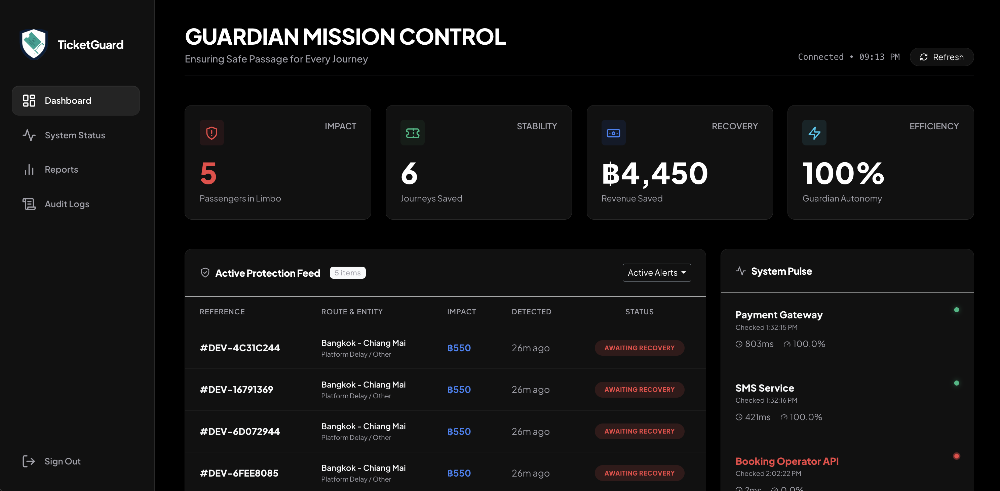

# 🛡️ TicketGuard: Revenue Recovery Engine

[](https://github.com/MethasMP/ticketguard)
[](https://github.com/MethasMP/ticketguard)
[](https://github.com/MethasMP/ticketguard)

> **"ได้รับเงินแล้ว แต่ไม่ออกตั๋ว — เราหาเจอ แก้เอง และแจ้งลูกค้าทันที"**

TicketGuard is a mission-critical support automation engine designed to solve the **"Stuck Booking"** problem. It automatically detects and recovers distributed system failures where a customer is charged, but the booking fails to confirm.



---

## 📈 The Engineering Challenge: Asynchronous Fragility

Online booking systems rely on **External Payment Providers**. The gap between **Payment Success** and **Booking Confirmation** creates a "distributed state" risk that cannot be wrapped in a single database transaction.

### Why "Stuck Bookings" are inevitable (The Thai Context)

| Payment Method | Why it fails |
|---------------|--------------|
| **PromptPay** | Webhook from Bank/ธปท. delayed or lost during peak traffic. |
| **Credit Card** | Timeouts between Card Issuer → Gateway → App callback. |
| **I-Banking** | User closes browser before the redirect/callback is completed. |

---

## 🏗️ Core Capabilities

### 1. 🔍 Autonomous Detection (`AnomalyDetectionJob`)
- Scans `payment_status = SUCCESS` + `booking_status = PENDING` every 5 minutes.
- **Circuit Breaker Logic**: Automatically halts recovery if critical endpoints (Payment Gateway, SMS) are DOWN to prevent state corruption.

### 2. ⚡ Zero-Touch Recovery (Pulse Mode)
- **Staggered Execution**: Implements a 1-second pulse delay between recoveries to avoid database spikes.
- **Atomic Operations**: Every fix is wrapped in an **EF Core Execution Strategy** (SQL Transaction) — either it works completely, or it rolls back.

### 3. 📱 Proactive Communication (`SmsNotificationService`)
- Once recovered, the system triggers an automated notification (Thai/English).
- *"ระบบ TicketGuard ได้ยืนยันตั๋วให้ท่านเรียบร้อยแล้ว..."*

### 4. 📊 Monthly PDF Intelligence (`ReportService`)
- Generates professional PDF reports using **QuestPDF**.
- Metrics: **Revenue Recovered**, **Mean Time to Resolve (MTTR)**, and **Endpoint Uptime**.

### 5. 🛡️ Dashboard Terminology
- **🔴 AWAITING RECOVERY**: System has intercepted a stuck booking. The recovery engine is currently managing the retry sequence.
- **🟢 SECURED**: The booking has been successfully restored, ticket issued, and customer notified.
- **⚪ DISCARDED**: Manual oversight confirmed the anomaly was a false positive (e.g., manual refund already issued).

---

## 🧠 Architecture Overview

### Request Lifecycle
1. **Detection**: `BackgroundService` identifies anomalies.
2. **Analysis**: Link anomaly to a specific endpoint outage (e.g., "Omise Webhook Outage").
3. **Execution**: Service Layer applies the fix with a secure audit trail.
4. **Verification**: SMS confirmation and PDF logging.

### Key Components
- **Identity**: JWT-based auth (derived from token, never from body).
- **Security**: PII Data Masking in audit logs + CSP Hardening.
- **Reporting**: High-fidelity PDF generation (not just HTML-to-PDF).

---

## 🚀 Quick Start

**Prerequisites**: [Docker Desktop](https://www.docker.com/products/docker-desktop/) · [.NET 8 SDK](https://dotnet.microsoft.com/download)

### 1. Stand up Infrastructure
```bash
docker-compose up -d
```

### 2. Start the Application
```bash
cd BookingGuardian && dotnet run
```

### 3. Default Credentials
| Role | Email | Password |
|------|-------|----------|
| **Admin** | `admin@monitor.dev` | `Monitor1234!` |

---

## 📋 Project Structure

```bash
booking-guardian/
├── BookingGuardian/
│   ├── Controllers/          # JWT Protected Endpoints
│   ├── Services/             # Business Logic (Recovery, PDF, SMS)
│   ├── BackgroundServices/   # Anomaly Detection & Health Monitoring
│   ├── Data/                 # EF Core DBContext & Migrations
│   └── Views/                # Razor Dashboard & Reporting UI
├── BookingGuardian.Tests/    # Unit Tests (xUnit + Moq)
└── docker-compose.yml        # MySQL 8.0 Environment
```

---

## 🧪 Testing & Reliability
```bash
cd BookingGuardian.Tests && dotnet test
```
The project maintains a high coverage bar for the **Recovery Service** to ensure no edge cases (like double-charging or double-issuing) occur during auto-fixes.

---

## 🗺️ Roadmap
- [ ] **Direct API Reconciliation**: Integration with Stripe/2C2P APIs to verify settlement before recovery.
- [ ] **Predictive Outage Detection**: Statistical analysis to signal provider issues *before* ping-checks fail.
- [ ] **Slack/Teams Ops Relay**: Real-time alerts for DevOps during major Songkran/Peak-season outages.

---

## 🔐 Environment Variables
- `DB_CONNECTION_STRING`: MySQL connection.
- `JWT_SECRET`: Minimum 32 characters key.
- `DETECTION_INTERVAL_MINUTES`: Frequency of scans (Default: 5).

---

## Author
**Methas Pakpoompong**  
[GitHub](https://github.com/MethasMP) | [LinkedIn](https://www.linkedin.com/in/methas-pakpoompong-36584023a/)

*"Building resilient systems for a non-resilient world."*
